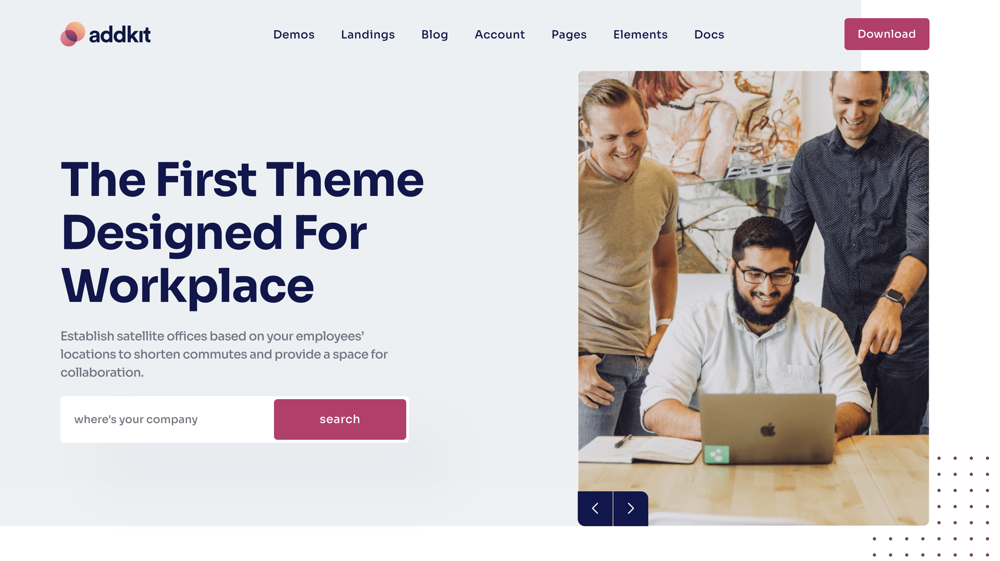

# Images & Favicon

## **Images**

Addkit template downloaded package does not contain images which are there in our online demo. We are using placeholder images instead of real images. You will see the image code as mentioned below. You can replace placeholder image **URL** with your image url like `./assets/img/Image_URL.png`



## **Favicons**

To change the favicon images of your site, just replace all images inside `./assets/img/favicons` folder with your site logo images.

```markup
<link rel="apple-touch-icon" sizes="180x180" href="../assets/img/favicon/apple-touch-icon.png">
<link rel="icon" type="image/png" sizes="32x32" href="../assets/img/favicon/favicon-32x32.png">
<link rel="icon" type="image/png" sizes="16x16" href="../assets/img/favicon/favicon-16x16.png">
<link rel="mask-icon" href="../assets/img/favicon/safari-pinned-tab.svg" color="#5bbad5">
```


